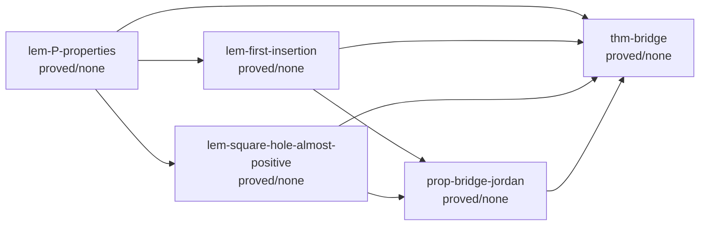

<!-- GENERATED by scripts/argument.py --generate. Do not hand-edit. -->
# Argument DAG (5 results, 8 edges)

```mermaid
graph LR
  lem-P-properties["lem-P-properties<br/>proved/none"]
  lem-first-insertion["lem-first-insertion<br/>proved/none"]
  lem-square-hole-almost-positive["lem-square-hole-almost-positive<br/>proved/none"]
  prop-bridge-jordan["prop-bridge-jordan<br/>proved/none"]
  thm-bridge["thm-bridge<br/>proved/none"]
  lem-P-properties --> lem-first-insertion
  lem-P-properties --> lem-square-hole-almost-positive
  lem-first-insertion --> prop-bridge-jordan
  lem-square-hole-almost-positive --> prop-bridge-jordan
  lem-P-properties --> thm-bridge
  lem-first-insertion --> thm-bridge
  lem-square-hole-almost-positive --> thm-bridge
  prop-bridge-jordan --> thm-bridge
```
