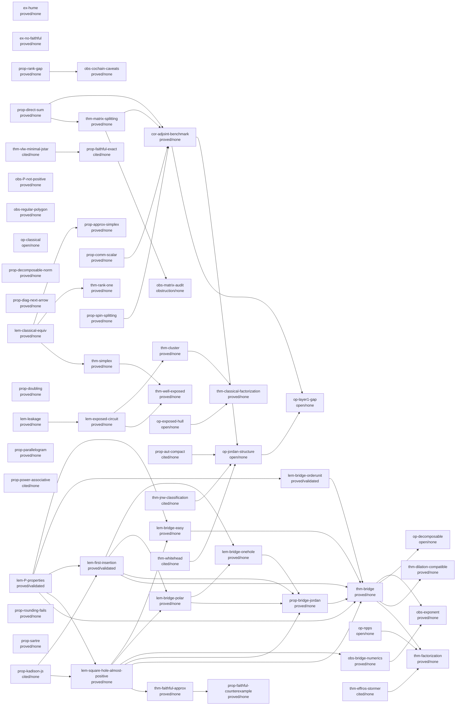

<!-- GENERATED by scripts/argument.py --generate. Do not hand-edit. -->
# Argument DAG (56 results, 54 edges)

```mermaid
graph LR
  cor-adjoint-benchmark["cor-adjoint-benchmark<br/>proved/none"]
  ex-hume["ex-hume<br/>proved/none"]
  ex-no-faithful["ex-no-faithful<br/>proved/none"]
  lem-P-properties["lem-P-properties<br/>proved/validated"]
  lem-bridge-easy["lem-bridge-easy<br/>proved/none"]
  lem-bridge-onehole["lem-bridge-onehole<br/>proved/none"]
  lem-bridge-orderunit["lem-bridge-orderunit<br/>proved/validated"]
  lem-bridge-polar["lem-bridge-polar<br/>proved/none"]
  lem-classical-equiv["lem-classical-equiv<br/>proved/none"]
  lem-exposed-circuit["lem-exposed-circuit<br/>proved/none"]
  lem-first-insertion["lem-first-insertion<br/>proved/validated"]
  lem-leakage["lem-leakage<br/>proved/none"]
  lem-square-hole-almost-positive["lem-square-hole-almost-positive<br/>proved/none"]
  obs-P-not-positive["obs-P-not-positive<br/>proved/none"]
  obs-bridge-numerics["obs-bridge-numerics<br/>proved/none"]
  obs-cochain-caveats["obs-cochain-caveats<br/>proved/none"]
  obs-exponent["obs-exponent<br/>proved/none"]
  obs-matrix-audit["obs-matrix-audit<br/>obstruction/none"]
  obs-regular-polygon["obs-regular-polygon<br/>proved/none"]
  op-classical["op-classical<br/>open/none"]
  op-decomposable["op-decomposable<br/>open/none"]
  op-exposed-hull["op-exposed-hull<br/>open/none"]
  op-jordan-structure["op-jordan-structure<br/>open/none"]
  op-layer1-gap["op-layer1-gap<br/>open/none"]
  op-npps["op-npps<br/>open/none"]
  prop-approx-simplex["prop-approx-simplex<br/>proved/none"]
  prop-aut-compact["prop-aut-compact<br/>cited/none"]
  prop-bridge-jordan["prop-bridge-jordan<br/>proved/none"]
  prop-comm-scalar["prop-comm-scalar<br/>proved/none"]
  prop-decomposable-norm["prop-decomposable-norm<br/>proved/none"]
  prop-diag-next-arrow["prop-diag-next-arrow<br/>proved/none"]
  prop-direct-sum["prop-direct-sum<br/>proved/none"]
  prop-doubling["prop-doubling<br/>proved/none"]
  prop-faithful-counterexample["prop-faithful-counterexample<br/>proved/none"]
  prop-faithful-exact["prop-faithful-exact<br/>cited/none"]
  prop-kadison-js["prop-kadison-js<br/>cited/none"]
  prop-parallelogram["prop-parallelogram<br/>proved/none"]
  prop-power-associative["prop-power-associative<br/>cited/none"]
  prop-rank-gap["prop-rank-gap<br/>proved/none"]
  prop-rounding-fails["prop-rounding-fails<br/>proved/none"]
  prop-sartre["prop-sartre<br/>proved/none"]
  prop-spin-splitting["prop-spin-splitting<br/>proved/none"]
  thm-bridge["thm-bridge<br/>proved/none"]
  thm-classical-factorization["thm-classical-factorization<br/>proved/none"]
  thm-cluster["thm-cluster<br/>proved/none"]
  thm-dilation-compatible["thm-dilation-compatible<br/>proved/none"]
  thm-effros-stormer["thm-effros-stormer<br/>cited/none"]
  thm-factorization["thm-factorization<br/>proved/none"]
  thm-faithful-approx["thm-faithful-approx<br/>proved/none"]
  thm-jnw-classification["thm-jnw-classification<br/>cited/none"]
  thm-matrix-splitting["thm-matrix-splitting<br/>proved/none"]
  thm-rank-one["thm-rank-one<br/>proved/none"]
  thm-simplex["thm-simplex<br/>proved/none"]
  thm-vlw-minimal-jstar["thm-vlw-minimal-jstar<br/>cited/none"]
  thm-well-exposed["thm-well-exposed<br/>proved/none"]
  thm-whitehead["thm-whitehead<br/>cited/none"]
  prop-spin-splitting --> cor-adjoint-benchmark
  prop-direct-sum --> cor-adjoint-benchmark
  prop-comm-scalar --> cor-adjoint-benchmark
  thm-matrix-splitting --> cor-adjoint-benchmark
  lem-P-properties --> lem-bridge-easy
  lem-square-hole-almost-positive --> lem-bridge-easy
  lem-first-insertion --> lem-bridge-onehole
  lem-bridge-polar --> lem-bridge-onehole
  lem-P-properties --> lem-bridge-orderunit
  lem-first-insertion --> lem-bridge-polar
  lem-square-hole-almost-positive --> lem-bridge-polar
  lem-leakage --> lem-exposed-circuit
  lem-P-properties --> lem-first-insertion
  prop-kadison-js --> lem-first-insertion
  lem-P-properties --> lem-square-hole-almost-positive
  prop-kadison-js --> lem-square-hole-almost-positive
  lem-square-hole-almost-positive --> obs-bridge-numerics
  prop-rank-gap --> obs-cochain-caveats
  thm-bridge --> obs-exponent
  obs-bridge-numerics --> obs-exponent
  thm-matrix-splitting --> obs-matrix-audit
  thm-bridge --> op-decomposable
  thm-jnw-classification --> op-jordan-structure
  thm-whitehead --> op-jordan-structure
  prop-aut-compact --> op-jordan-structure
  cor-adjoint-benchmark --> op-jordan-structure
  cor-adjoint-benchmark --> op-layer1-gap
  op-jordan-structure --> op-layer1-gap
  lem-classical-equiv --> prop-approx-simplex
  lem-first-insertion --> prop-bridge-jordan
  lem-square-hole-almost-positive --> prop-bridge-jordan
  lem-bridge-polar --> prop-bridge-jordan
  lem-bridge-onehole --> prop-bridge-jordan
  thm-faithful-approx --> prop-faithful-counterexample
  thm-vlw-minimal-jstar --> prop-faithful-exact
  lem-P-properties --> thm-bridge
  lem-first-insertion --> thm-bridge
  lem-square-hole-almost-positive --> thm-bridge
  prop-bridge-jordan --> thm-bridge
  lem-bridge-easy --> thm-bridge
  lem-bridge-orderunit --> thm-bridge
  thm-cluster --> thm-classical-factorization
  op-exposed-hull --> thm-classical-factorization
  lem-exposed-circuit --> thm-cluster
  thm-bridge --> thm-dilation-compatible
  op-npps --> thm-factorization
  thm-effros-stormer --> thm-factorization
  thm-bridge --> thm-factorization
  lem-square-hole-almost-positive --> thm-faithful-approx
  prop-direct-sum --> thm-matrix-splitting
  lem-classical-equiv --> thm-rank-one
  lem-classical-equiv --> thm-simplex
  thm-simplex --> thm-well-exposed
  lem-exposed-circuit --> thm-well-exposed
```
